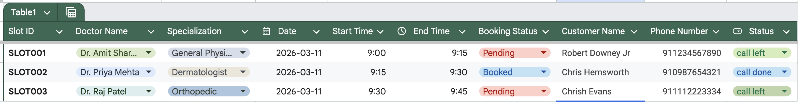

# Building an Appointment Follow-Up System with VideoSDK AI Telephony and N8N

Managing appointment confirmations manually is time-consuming and error-prone. What if an AI agent could automatically call your customers, confirm their appointments, and update your records — all without human intervention? In this guide, we'll walk you through building exactly that using **VideoSDK AI Telephony** and **N8N**.

---

## What We're Building

This workflow automates outbound appointment follow-up calls. An AI agent calls customers from a Google Sheet, asks whether they'll be attending their scheduled appointment, and updates the booking status automatically — sequentially, one customer at a time.

---

## How It Works End-to-End

Once running, here's what happens automatically:

1. N8N reads your Google Sheet and finds all rows where **Status = `call left`**
2. It initiates an outbound call to the first customer via VideoSDK
3. The AI agent speaks with the customer and confirms whether they'll attend their appointment
4. Based on the customer's response:
   - **Attending** → `Booking Status` is updated to `Booked`
   - **Not attending** → `Booking Status` is updated to `Cancelled`
5. The customer's **Status** is updated to `call done`
6. Once the call ends, the workflow moves to the **next customer** with `call left` status
7. This continues **sequentially** until all pending customers have been contacted

---

## Prerequisites

Before we begin, make sure you have:

- A [VideoSDK](https://videosdk.live) account (for AI telephony)
- An [N8N](https://n8n.io) account (free trial available)
- A Google Sheet set up with your appointment data
- On N8N after sign in, authenticate your Google account so that you can use Google Sheets directly. Click on the Google Sheets node, click on authentication, and select your credentials.
- You can refer to the N8N documentation here: [N8N Docs](https://docs.n8n.io/)
- You need to select your respective sheet and page in the Sheets node — refer to the N8N documentation for guidance
- You need to paste the webhook URL from the webhook node to the VideoSDK telephony webhooks
- Your VideoSDK Auth Token and API keys ready
- Create `Gateway ID` and `Agent ID`

---

Refer to the VideoSDK docs for full configuration options:
- [AI Phone Agent Quick Start](https://docs.videosdk.live/ai_agents/ai-phone-agent-quick-start#making-an-outbound-call)
- [Making Outbound Calls](https://docs.videosdk.live/telephony/managing-calls/making-outbound-calls)
- [SIP Webhooks Reference](https://docs.videosdk.live/telephony/managing-calls/sip-webhooks)

---

## Step 1: Set Up Your Google Sheet

Your Google Sheet is the data source that drives the entire workflow. Structure it with the following columns:



### Key columns to understand:

- **Booking Status** — Tracks appointment confirmation. Starts as `Pending`, updated to `Booked` or `Cancelled` after the call.
- **Status** — Tracks whether the customer has been contacted. Has three states:
  - `call left` — Customer hasn't been called yet
  - `calling` — Call is currently in progress
  - `call done` — Call has been completed

> The AI agent will **only call customers whose Status is `call left`**, ensuring no one gets called twice.

---

## Step 2: Create Your N8N Workflow

### 2.1 Import the Pre-Built Workflow

N8N lets you import workflows directly from a JSON, so you don't have to build from scratch.

1. Log in to your N8N account and open the canvas
2. Click the **three-dot menu** (⋮) in the top right
3. Select **"Import from file"**
4. Upload the provided `customer_followup_agent.json` workflow file
5. Your workflow will appear on the canvas, fully assembled

### 2.2 Understand the Three Core Nodes

Once imported, you'll see three main components in your workflow:

**① MCP Server Trigger**
MCP Server Trigger is used so that your AI Agent can perform specific operations. You can use it for fetching data, updating data, and more.

**② HTTP POST Request (Calling Customer Node)**
This node is responsible for initiating the outbound call to the customer via VideoSDK's telephony API.

**③ Webhook Trigger (Capturing Call Events)**
This node listens for real-time call events (call-answered, call-hangup, etc.) from VideoSDK, allowing the workflow to react when a call concludes.

---

## Step 3: Connect Your AI Agent via MCP

1. Click on the **MCP Server** node in N8N
2. Copy the **Production URL** shown
3. Paste it into your `appointment_telephony.py` agent code:

```python
mcp_servers=[
    MCPServerHTTP(
        endpoint_url="[Your Production URL Here]",
    )
]
```

> Use the **Test URL** during development, and switch to the **Production URL** when going live.

---

## Step 4: Configure Your Agent Instructions

Open `appointment_telephony.py` 

This script contains the default AI agent instructions that guide how the agent speaks to customers, handles responses, and triggers the appropriate N8N workflow actions.

---

## Step 5: Run the Workflow

Follow these steps in order:

1. **Run the agent script**
   ```bash
   python appointment_telephony.py
   ```

2. **Publish your N8N workflow**
   - Open the workflow in N8N
   - Click the **Publish** button to activate it

3. **Execute the workflow**
   - Click the dropdown arrow next to **"Execute Workflow"**
   - Select **"When clicking 'Execute workflow'"**
   - Click **"Execute Workflow"** to start the process

